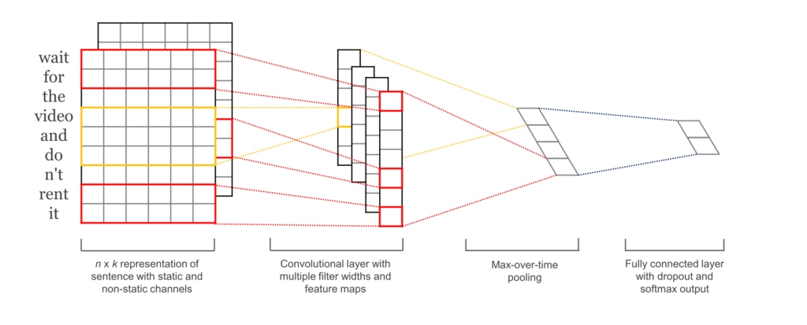
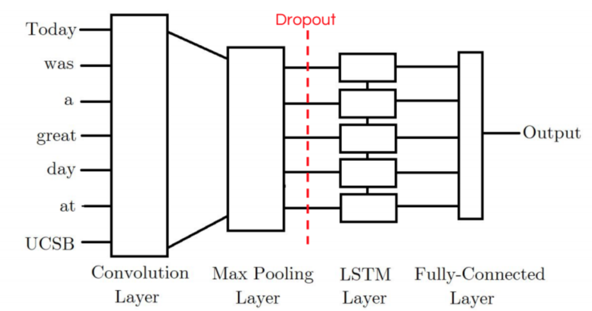
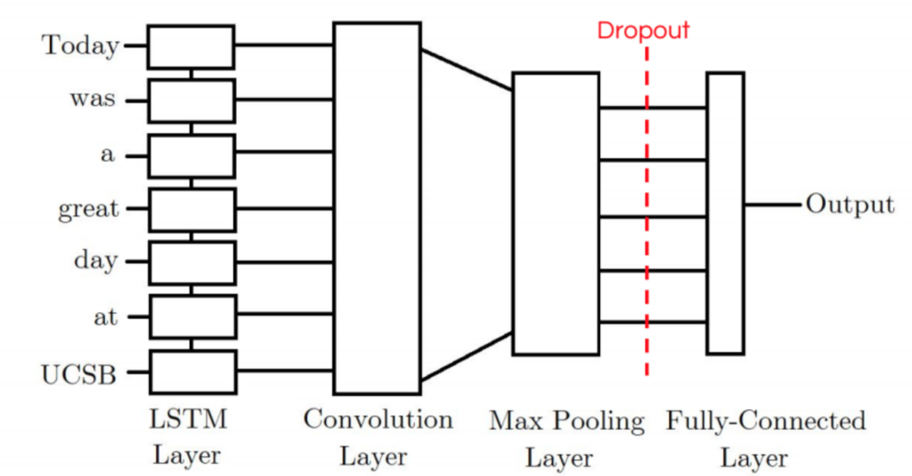

# Convolutional-Neural-Networks-for-Sentence-Classification

### Old work related to the paper ' Convolutional Neural Networks for Sentence Classification ' 
- https://arxiv.org/pdf/1408.5882.pdf

It train a simple (CNN) with one layer of convolution on top of word vectors obtained from an unsupervised neural language model. These vectors were trained by Mikolov etal. (2013) on 100 billion words of Google News, and are publicly available.1 We initially keep the word vectors static and learn only the other parameters of the model. Despite little tuning of hyperparameters, this simple model achieves excellent results on multiple benchmarks.

# What is new work we add on the old one and our contributions?

Instead of unsing only the CNN to make the Sentence Classification we will use CNN in as well as LSTM to generate a combination model of them( CNN-LSTM ) and ( LSTM-CNN )

# CNNs

Convolutional Neural Networks (CNNs) are networks initially created for image-related tasks that can learn to capture specific features regardless of locality.

For a more concrete example of that, imagine we use CNNs to distinguish pictures of Cars vs. pictures of Dogs. Since CNNs learn to capture features regardless of where these might be, the CNN will learn that cars have wheels, and every time it sees a wheel, regardless of where it is on the picture, that feature will activate.

In our particular case, it could capture a negative phrase such as "don't like" regardless of where it happens in the tweet.

*     I don't like watching those types of films
*     That's the one thing I really don't like.
*     I saw the movie, and I don't like how it ended.

# LSTMs

Long-Term Short Term Memory (LSTMs) are a type of network that has a memory that "remembers" previous data from the input and makes decisions based on that knowledge. These networks are more directly suited for written data inputs, since each word in a sentence has meaning based on the surrounding words (previous and upcoming words).

In our particular case, it is possible that an LSTM could allow us to capture changing sentiment in a tweet. For example, a sentence such as: At first I loved it, but then I ended up hating it. has words with conflicting sentiments that would end-up confusing a simple Feed-Forward network. The LSTM, on the other hand, could learn that sentiments expressed towards the end of a sentence mean more than those expressed at the start.

# CNN-LSTM Model

The first model I tried was the CNN-LSTM Model. Our CNN-LSTM model combination consists of an initial convolution layer which will receive word embeddings as input. Its output will then be pooled to a smaller dimension which is then fed into an LSTM layer. The intuition behind this model is that the convolution layer will extract local features and the LSTM layer will then be able to use the ordering of said features to learn about the input’s text ordering. In practice, this model is not as powerful as our other LSTM-CNN model proposed.

# LSTM-CNN Model

Our CNN-LSTM model consists of an initial LSTM layer which will receive word embeddings for each token in the tweet as inputs. The intuition is that its output tokens will store information not only of the initial token, but also any previous tokens; In other words, the LSTM layer is generating a new encoding for the original input. The output of the LSTM layer is then fed into a convolution layer which we expect will extract local features. Finally the convolution layer’s output will be pooled to a smaller dimension and ultimately outputted as either a positive or negative label.

